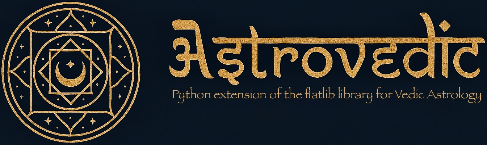

# Astrovedic - Vedic Astrology Library

<p align="center">
  
</p>

> **⚠️ IMPORTANT: This library is currently under active development and is not yet ready for production use. APIs may change, and features are still being implemented and tested.**

Astrovedic is a comprehensive Python library for Vedic and Traditional Astrology, evolved from the original flatlib library. It has been significantly enhanced with extensive Vedic astrology features while maintaining compatibility with Western astrological techniques.

## About

Astrovedic represents a major evolution from flatlib, with a focus on providing exhaustive and detailed implementations of Vedic astrology techniques. The project has been renamed to reflect its primary focus on Vedic astrology while acknowledging its roots in traditional Western astrology.

Key enhancements include:
- Comprehensive Vedic astrology calculations and techniques
- Improved performance through optimized algorithms and caching
- Enhanced API for easier integration
- Extensive test coverage to ensure accuracy

```python
# Example of Vedic chart with Lahiri ayanamsa
from astrovedic.datetime import Datetime
from astrovedic.geopos import GeoPos
from astrovedic.chart import Chart
from astrovedic import const
from astrovedic.vedic.nakshatras import get_nakshatra

# Create a chart for Bangalore, India
date = Datetime('2025/04/09', '20:51', '+05:30')
pos = GeoPos(12.9716, 77.5946)  # Bangalore
chart = Chart(date, pos, hsys=const.HOUSES_WHOLE_SIGN, mode=const.AY_LAHIRI)

# Get Moon position and nakshatra
moon = chart.getObject(const.MOON)
nakshatra_info = get_nakshatra(moon.lon)

print(f"Moon: {moon.sign} {moon.signlon:.2f}°")
print(f"Nakshatra: {nakshatra_info['name']} (Pada {nakshatra_info['pada']})")
```

## Features

- **Vedic Ayanamsas**: Support for multiple Vedic ayanamsas including Lahiri, Krishnamurti, and more
- **Nakshatras**: Calculations for the 27 nakshatras (lunar mansions) and their padas (quarters)
- **Panchang**: Vedic almanac elements including tithi, yoga, karana, and more
- **KP Astrology**: Krishnamurti Paddhati features including sublord calculations
- **Shadow Planets**: Support for upagrah (shadow planets) like Gulika, Mandi, etc.
- **Outer Planets**: Support for Uranus, Neptune, and Pluto in Vedic calculations
- **Core Calculations**: Focus on accurate astrological calculations with minimal interpretation

## Architecture

Astrovedic is designed with a clear separation between core calculations and detailed analysis/reporting:

- **Core Library**: Focuses on accurate astrological calculations and core functionality
- **Analysis Modules**: Contains detailed analysis, interpretations, and reporting functionality

This separation allows the core library to remain focused and efficient while providing a path for more detailed analysis through specialized modules.

## Installation

Astrovedic is a Python 3 package. Make sure you have Python 3.8+ installed on your system.

```bash
# Install from PyPI (coming soon)
# pip install astrovedic

# Install directly from GitHub
pip install git+https://github.com/cryptekbits/astrovedic.git

# For development installation
git clone https://github.com/cryptekbits/astrovedic.git
cd astrovedic
pip install -e .
```

## Documentation

Documentation is currently being updated to reflect the name change and new features. More comprehensive documentation will be available soon.

For now, you can explore the following resources:

- Code examples in the `examples/` directory
- Docstrings within the code
- Test cases that demonstrate functionality

## Examples

Check the `examples/` directory for example scripts:

- `examples/vedic_chart.py`: Basic Vedic chart calculations
- `examples/dainik_panchang.py`: Daily panchang calculations
- `examples/vimshottari_dasha.py`: Vimshottari dasha calculations
- `examples/divisional_charts.py`: Divisional charts (Vargas)
- `examples/shadbala_calculator.py`: Planetary strength calculations
- `examples/compatibility_calculator.py`: Compatibility analysis
- `examples/muhurta_calculator.py`: Electional astrology
- `examples/transit_calculator.py`: Transit analysis

## Testing

Astrovedic includes a comprehensive test suite to ensure accuracy and reliability of calculations.

### Running Tests

```bash
# Run all tests
./run_tests.py

# Run tests in a specific category
./run_tests.py --category vedic

# Generate HTML report
./run_tests.py --html

# Include tests that are known to fail
./run_tests.py --include-failing
```

Test reports are generated in the `reports` directory and include detailed information about each test.

### Adding Tests

See `docs/test_creation_guidelines.md` for detailed information on creating and maintaining tests.

## Development

Astrovedic evolved from the original flatlib library, with significant enhancements and a focus on Vedic astrology features. The project is currently under active development.

### Roadmap

- [ ] Complete documentation update
- [ ] Publish to PyPI
- [ ] Implement additional Vedic techniques
- [ ] Optimize performance for large-scale calculations
- [ ] Create comprehensive examples and tutorials
- [ ] Develop a web-based demonstration interface

### Commit Message Format

We follow the [Conventional Commits](https://www.conventionalcommits.org/) specification for commit messages:

```
feat(vedic): implement Vimshottari Dasha system

- Create core dasha calculations based on Moon's nakshatra
- Implement main periods (Mahadashas) with precise dates
- Add sub-period (Antardasha/Bhukti) calculations
- Include utility functions for finding current period
```

Common types include:
- `feat`: A new feature
- `fix`: A bug fix
- `docs`: Documentation changes
- `refactor`: Code changes that neither fix bugs nor add features
- `test`: Adding or updating tests
- `chore`: Changes to build process or auxiliary tools

### Contributing

Contributions are welcome! If you'd like to contribute to Astrovedic, please:

1. Fork the repository
2. Create a feature branch (`git checkout -b feature/amazing-feature`)
3. Make your changes
4. Run tests to ensure they pass
5. Commit your changes following the commit message format
6. Push to the branch (`git push origin feature/amazing-feature`)
7. Open a Pull Request

## License

This project is licensed under the MIT License - see the LICENSE file for details.

## Acknowledgments

- Original flatlib library by João Ventura
- Swiss Ephemeris for astronomical calculations
- All contributors to the project